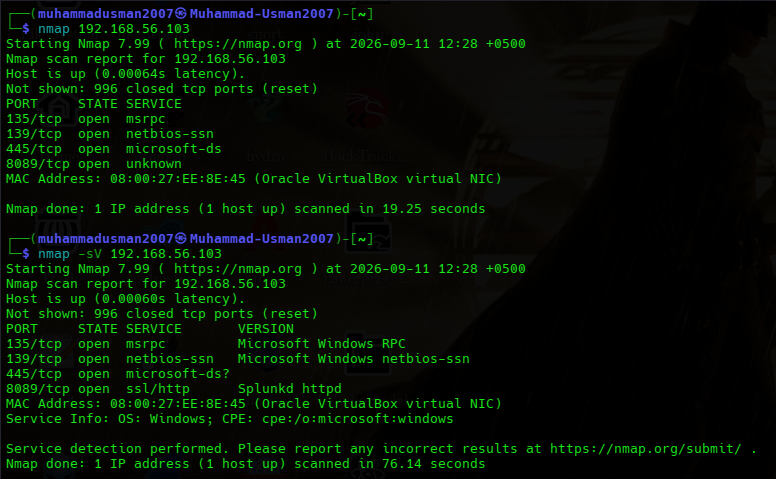

# Nmap Port Scan — Test Results

## Overview
Nmap was used to perform a basic port scan against an authorized Windows 10 virtual machine in my local cybersecurity lab environment.

* **Target System:** Windows 10 Virtual Machine
* **Target IP:** `192.168.56.103`
* **Scanner:** Kali Linux
* **Environment:** VirtualBox Host-Only Lab Network

> [!IMPORTANT]
> The scan was performed strictly within an isolated laboratory environment against a system that I own and control.

---

## Scan Scope

| Parameter | Details |
| :--- | :--- |
| **Target** | Windows 10 Virtual Machine |
| **Scanner** | Kali Linux |
| **Network** | VirtualBox Host-Only Lab Network |
| **Target IP** | `192.168.56.103` |

---

## Scan Execution & Results

### 1. Basic Nmap Scan
The initial default scan was executed to locate open TCP ports:

```bash
nmap 192.168.56.103
```
## The service detection scan provided the following results:
| Port | State | Detected Service |
| :--- | :--- | :--- |
| `135/tcp` | Open | Microsoft Windows RPC |
| `139/tcp` | Open | Microsoft Windows NetBIOS |
| `445/tcp` | Open | Microsoft SMB / microsoft-ds |
| `8089/tcp` | Open | SSL/HTTP — Splunkd httpd |

## Nmap also identified the target operating system as **Windows**.

---

## Findings

### Port 135 — Microsoft RPC
* TCP port `135` was open and identified as Microsoft Windows RPC.
* RPC is used by Windows for communication between applications and services.
* An exposed RPC service should be restricted to trusted networks where possible.

### Port 139 — NetBIOS
* TCP port `139` was open and associated with NetBIOS session services.
* NetBIOS is an older Windows networking technology and may be associated with file and printer sharing.

### Port 445 — SMB
* TCP port `445` was open and associated with Microsoft SMB services.
* SMB is commonly used for Windows file and printer sharing.
* Because SMB can expose sensitive network resources when improperly configured, access should be restricted to trusted systems and networks.

### Port 8089 — Splunk
* TCP port `8089` was detected as an SSL/HTTP Splunkd service.
* This port is used by the Splunk installation within my cybersecurity lab.
* Because this service is part of my own SOC lab, its presence is expected.

---

## Security Observations

* The scan demonstrates how network scanning can quickly identify services exposed on a system.
* Open ports are not automatically vulnerabilities. However, every exposed service contributes to the system's attack surface and should be reviewed to determine whether it is required and appropriately secured.
* In this lab, ports `135`, `139`, and `445` are associated with Windows networking services, while port `8089` is associated with the Splunk installation used for the SOC lab.

---

## Recommendations

* Disable unnecessary services where possible.
* Restrict Windows RPC and SMB access to trusted networks.
* Avoid exposing SMB services directly to untrusted networks.
* Restrict management interfaces such as Splunk to authorized systems.
* Use firewall rules to limit unnecessary network exposure.
* Regularly scan authorized systems to identify unexpected open ports.

---

## Evidence

The Nmap commands and scan results are documented in:



---

## Conclusion

The Nmap scan successfully identified four open TCP ports on the Windows 10 virtual machine and provided additional service information using version detection.

This exercise provided practical experience with network reconnaissance, port identification, service detection, and basic attack-surface analysis within an authorized lab environment.
