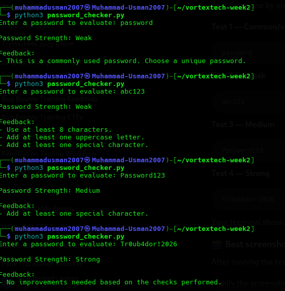

# Password Strength Evaluator — Test Results

## Overview
The password strength evaluator was developed in Python as part of Week 2 of the Vortex Tech Cybersecurity Internship 2026.

The script evaluates passwords using:
* Password length
* Uppercase characters
* Lowercase characters
* Numbers
* Special characters
* Common-password checks

The purpose of testing was to verify that the script correctly identifies different levels of password strength and provides useful feedback.

## Test Cases

| Test Password | Strength | Result |
| :--- | :--- | :--- |
| `password` | Weak | Detected as a commonly used password |
| `abc123` | Weak | Does not meet enough strength requirements |
| `Password123` | Medium | Meets most character requirements but lacks a special character |
| `Tr0ub4dor!2026` | Strong | Meets all implemented strength requirements |

---

### Test 1 — Common Password
* **Input:** `password`
* **Result:** Weak
* **Feedback:** This is a commonly used password. Choose a unique password.

The script correctly identifies the password as a commonly used password and rates it as weak.

### Test 2 — Short Password
* **Input:** `abc123`
* **Result:** Weak

The password contains lowercase letters and numbers, but it is shorter than the required minimum of 8 characters. It also does not contain an uppercase letter or special character.

### Test 3 — Moderate Password
* **Input:** `Password123`
* **Result:** Medium

The password satisfies the minimum length requirement and contains uppercase letters, lowercase letters, and numbers. However, it does not contain a special character, resulting in a medium rating.

### Test 4 — Strong Password
* **Input:** `Tr0ub4dor!2026`
* **Result:** Strong

The password satisfies all of the implemented checks:
* At least 8 characters
* Uppercase character
* Lowercase characters
* Numbers
* Special character
* Not present in the common-password list

---

## Observations
* The test results demonstrate that password length and character variety affect the evaluator's strength rating.
* The common-password check is also useful because a password may contain different character types while still being commonly used or predictable.
* The evaluator provides a basic educational assessment of password strength based on the checks implemented in the script. It should not be considered a complete measure of real-world password security.

## Security Relevance
* Weak or predictable passwords can increase the risk of unauthorized account access, particularly when passwords are reused or exposed through credential leaks.
* Using longer, unique passwords or passphrases and enabling multi-factor authentication can improve account security.

## Evidence
The test results are demonstrated in:
`screenshots/password_check.png`

## Conclusion
The password strength evaluator successfully handled all four test cases and produced Weak, Medium, and Strong classifications. 

This exercise provided practical experience with Python conditionals, character validation, scoring logic, and basic security-focused input analysis.
